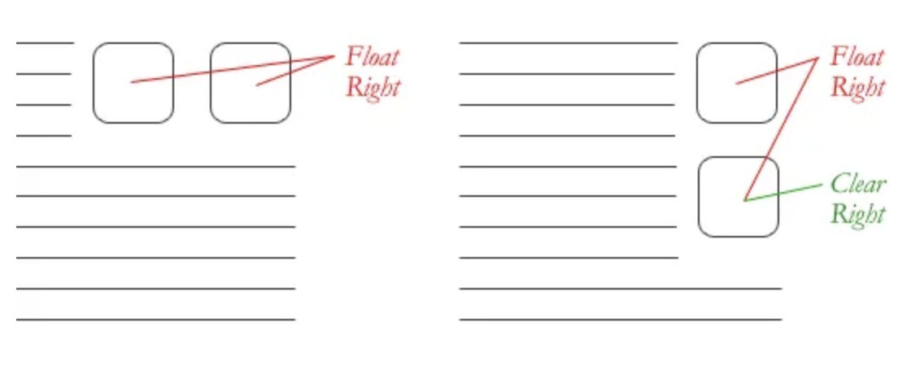

# Read:01 \| Responsive Web Design and Floats 
Article: [Shay Howe's intro to RWD](https://learn.shayhowe.com/advanced-html-css/responsive-web-design/)  &  Article: [All About Floats](https://css-tricks.com/all-about-floats/) 

---
## [Shay Howe's intro to RWD](https://learn.shayhowe.com/advanced-html-css/responsive-web-design/)  
---

**Responsive web design** is building a website that will work on every device and every screen size (mobile or desktop). RWD was coined by Ethan Marcotte.

#### Flexible layouts

- **Flexible layout** is the practice of building a layout with a flexible grid that dynamically resizes to any width
- Relative length units are written as either percentages, `em`, or `rem` as values for width, margin, or padding
- CSS3 introduced viewport size properties but they aren't widely used due to lack of browser support currently
- Try to avoid fixed measurement units such as pixels or inches
- Aim to set the width of an element by dividing it by the width of its parent
- For more control and a flex layout, take advantage of `min-width`, `max-width`, `min-height`, and `max-height` properties

#### Media queries

- A media query is like a version of an if statement in a CSS file to determine the viewport size of the device that directs it to use one set of styles or another
- In the CSS file you'd type someting like: `@media all and (max-width: 1024px) { ... }`
- Media types include: `all`, `screen`, `print`, `tv`, and `braille` (the default media type is `screen`)
- Three logical operators available for media queries: `and` (allows an extra condition), `not` (negate a query), `only` (disables styles on older browsers)
- **Media features** identify what attributes or properties will be targeted within the media query expression
- Min/max height and width media features are used to dictate when you want specific styles to only be used on a screen that is in the declared height and width of the `@media` query
- `@media` also has the property `orientation` with values `landscape` or `portrait`
- You can specify styles to be applied to specific aspect ratios, here is an example for this property: `min-device-aspect-ratio: 16/9`. (note the core property for this is `aspect-ratio`)
- You can also specify the DPI value by using the `resolution` property
- Breakpoints should only be used if a website starts to look weird or the experience is bad

  

#### Mobile first

- **Mobile first** is an approach that includes using styles targeted for smaller viewports as default styles for a website, and uses media queries to add styles as the viewport grows
- Here is an example of what mobile first media queries might look like:

  

- To help with identifying viewport, Apple invented the `viewport` meta tag:

```html
<meta name="viewport" content="width=device-width">
```

- To control how a website is scaled, in the meta viewport tag, set the content value to something like `initial-scale=2` (initial-scale should always be a positive integer between 0 and 10, the most common setting is 1)
- In the meta viewport tag, set the content value to `user-scalable=yes` to turn on zooming

#### Flexible media

- This is so that as websites are responsive to a viewport change, it allows the scalability of images, videos, and other media
- Quick way to make media scalable is to use the `max-width` property with a value of `100%`

```css
img, video, canvas {
  max-width: 100%;
}
```

- BE CAREFUL: `max-width` does not work around iframes or embedded media like Youtube videos (Google the workaround for this, it is pretty involved)


---
## [All About Floats](https://css-tricks.com/all-about-floats/) 
---

- Floated elements are not absolutely positioned and remain a part of the flow of the page
- There are four values for the `float` property: left, right, none (default), inherit (assumes float value of parent element)
- While floats can be used for layout, flexbox and grid are stronger tools for layout
- float is still good if you need text wrapping around images
- Use float instead of `position: absolute` if you want content to automatically reflow when changing the size of the element (i.e. an image element)
- CSS has a property `clear` which has four values: both, left, right, none
- An element with a `clear` property will move itself down past the float

  

- If a parent element contains nothing but floated elements, the height will collapse to nothing
  - To prevent strange layout issues, clear the float *after* other floated but *before* the end of the container
- In an example where you would want to start a new row with several items floating to the left, you would just clear the float where you want the breakpoint to happen by using the `overflow` method or the "easy clearing" method.

  


[Back to Home](README.md)