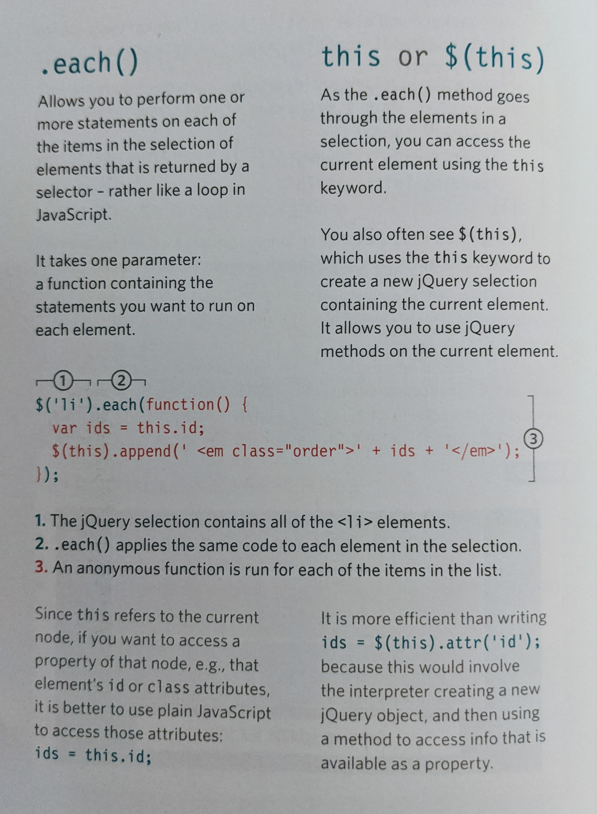
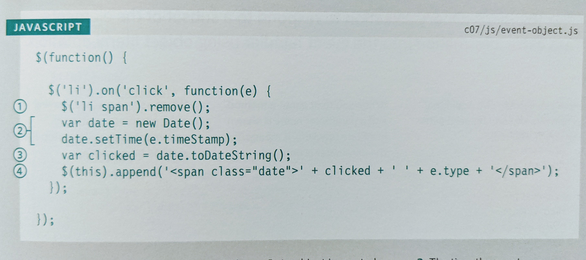

# Read:02 \| jQuery, Events and The DOM
[Textbook](https://www.amazon.com/dp/1118907442/ref=cm_sw_em_r_mt_dp_U_X77.EbAN2ACE2): _Jon Duckett: JavaScript & jQuery  *(JS book: Pages 293-301, 301-331, 354-357)*  
Article: [6 Reasons for Pair Programming](https://www.codefellows.org/blog/6-reasons-for-pair-programming/)


---
## jQuery, Events and The DOM
---

#### jQuery

- jQuery allows simpler access to elements, easily update the DOM tree with its methods, and attach listeners, using CSS selectors
- jQuery is a JS library that consists of methods

```js
$('li.hot').addClass('complete');
```

- Typically you'll connect the jQuery library using a **CDN** (Content Delivery Network) link in a `<script>` tag at the bottom of the `<body>` element, but above the `app.js` script tag. Many CDNs exist, here is [Google's CDN](https://developers.google.com/speed/libraries).
- You can add filters to your query selector
  - Ex: `:eq(index)`, `:first-child`, `:parent`
- The list of things you can do with your selection is: content filters, finding elements, dimension/position, effects and animation, events
- [Here](https://overapi.com/jquery) is a one-stop shop to jQuery methods that links to official documentation for each method.
- You can chain together several methods with dot notation.

```js
$('li[id!="one"]').hide().delay(500).fadeIn(1400);
```

- You will need to find a way to make sure the `document` is `.ready()`
- The difference between `.html()` and `.text()` is if you need to add element tags like `<em>` you'll use `.html()`. If you just need to change the content without adjusting an HTML tag you'll use `.text()`.
- The most popular methods for adding to the page are (outside of the selected element) `.before()`, `.after()`, (inside of the selected element) `.prepend()`, and `.append()`.
- Access, create, and update attributes with the following four methods: `.attr()`, `.removeAttr()`, `.addClass()`, `.removeClass()`.
- To set a CSS property through jQuery, use the `.css()` method and pass in the property and value as strings, for example (if setting multiple, use `{}` in JSON format):

```js
$('li').css('background-color', '#272727');
```

- The best way to understand `.each()` using `this` will be looking at an image from the textbook:

  

#### Events with jQuery

- The `.on()` method is used to handle events, such as click, dblclick, focus, blur, submit, etc.
- The first parameter for the `.on()` method is the event word like `click`. The second parameter is a function that usually takes the parameter `(e)`. Whatever you want to happen is executed inside the function's curly braces.

  

---
## Article \| [6 Reasons for Pair Programming](https://www.codefellows.org/blog/6-reasons-for-pair-programming/) by Code Fellows

---
> The best practices for a Software Developer: Iterative loops, Code reviews, Fast feedback, Error checking and linting
#### Pair Programming
- Two roles: **Driver** and the **Navigator**.   
  - Driver is the one typing, handling the mechanics (text editor, switching files, version control and code writing).   
  - Navigator uses words to guide driver but doesn't touch the computer / thinks about the big picture, what comes next, how an algo could be converted to code, scans for typos and bugs (they can use their own computer to google solutions and documentation)
- Six reasons to Pair Program are: Greater efficiency / Engaged collaboration / Learning from fellow students / Social skills / Job Interview readiness / Work environment readiness


[Back to Home](README.md)