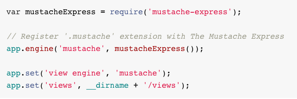
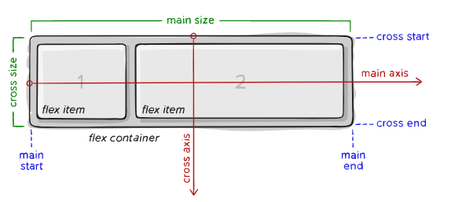

# Read:01 \| Responsive Web Design and Floats 
Article: [Templating with Mustache](https://medium.com/@1sherlynn/javascript-templating-language-and-engine-mustache-js-with-node-and-express-f4c2530e73b2)  &  Article: [A Guide to Flexbox](https://css-tricks.com/snippets/css/a-guide-to-flexbox/) 


---
## [Templating with Mustache](https://medium.com/@1sherlynn/javascript-templating-language-and-engine-mustache-js-with-node-and-express-f4c2530e73b2)  
---
- Mustache is a logic-less template syntax using values provided in a hash or object
- [mustache.js](https://github.com/janl/mustache.js) uses a mustache template system in JS, considered the base for JS templating.
- This is a specification for templating language that is compiled by a templating engine (like html) that will be rendered to create the output.
- To use mustache with **Node** and **Express**, it's ideal to use [mustache-express](https://www.npmjs.com/package/mustache-express)
  - You can install it using **npm** `> npm i mustache-express`
- Screenshot from [mustache-express](https://www.npmjs.com/package/mustache-express) on how to configure it in the JS file:   

- In router config use `res.render(TEMPLATE_NAME, JASON_DATA)` Ex: `res.render('hello', {"name": "Tiffany"})`
- It also take a var name like this: 
```
let nameObject = {"name": "Tif"}
res.render('hello', nameObject)
```


---
## [A Guide to Flexbox](https://css-tricks.com/snippets/css/a-guide-to-flexbox/)  
---



- The `display` property defines the container that will have children referred to as "items"

```css
.container {
  display: flex;
}
```

- You can set `flex-direction` in the container `row` or `column`
- In the container, there is `flex-wrap`, which by default will try to fit all items on one line. You can change the value of this property with `nowrap`, `wrap`, or `wrap-reverse`.

> Note: you can shorthand `flex-direction` and `flex-wrap` with `flex-flow: column wrap`

- The `justify-content` property dictates the horizontal starting point and the space definition of the items (on the main axis).
- The `align-items` property will dictate where items start from a vertical alignment perspective (on the cross axis).
- Using the `align-content` property you are justifying all of the items as a group within the main axis.
- Children are considered the `flex items` of the `container`.
- Items by default are in source order, but you can use the `order` property to control which order they appear in the container (`order: 1`, `order: 2`, etc.).
- The `flex` property is a shorthand for dictating `flex-grow`, `flex-shrink`, `flex-basis` (the last two are optional).
  - The default is `flex: 0 1 auto`
- To have an item override the default alignment from `align-items`, you can use the property `align-self`.


[Back to Home](README.md)