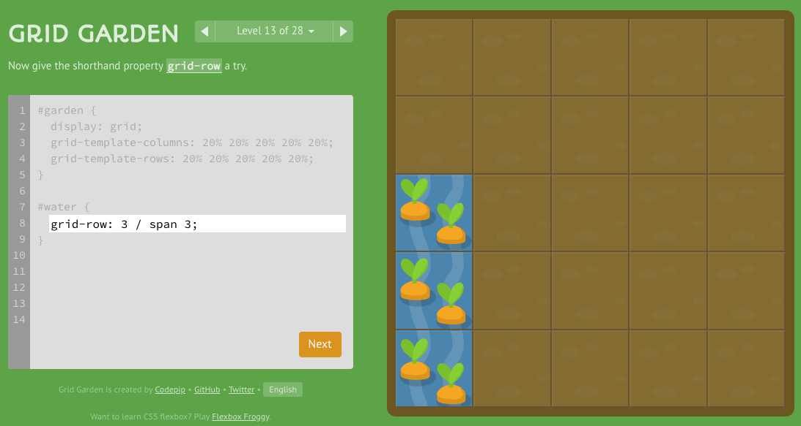

# Read:04 \| CSS Grid
### Game: [Grid Garden](https://cssgridgarden.com/) by Flexbox Froggy  

## Notes from playing the Grid Garden game

#### Setting up the Parent Container
- The parent (container) will set the `display` property to `grid`
- The parent will define the `grid-template-columns` and `grid-template-rows` with % values.
  - Ex: To make 5 column layout, 100 / 5 is 20, so 20% `grid-template-columns: 20% 20% 20% 20% 20%;`
  - You can also use the `repeat` feature like this: `grid-template-columns: repeat(8, 12.5%);`
- There is also a `unit` known as `fr` when setting the template, it's a fraction of the total units you want, like this: 
`grid-template-columns: 1fr 5fr;` This means of a 6-column-wide layout concept, have 1 column be 1/6th of the page and the 2nd column to be 5/6ths of the page

#### Horizontal axis with grid Columns
- The child item (like the #water in the above image) can be told where to start: `grid-column-start: 3;`
  - Use `grid-column-end:` as well if you want the item to span mulitple columns 
  >FYI: in the usual case, the end is not inclusive so add 1
- Using negative values is a little weird, so be sure to look it up before using it
- If you use the `span` keyword it will end that many columns away from your start: `grid-column-end: span 5;` means keep it across 5 columns no matter where you start (as opposed to just `end: 5` means stop at column 5 specifically)
  - You can do thte same thing with `start` while defining the specific end and spanning from start
> NOTE: There is a short hand that could like like this: `grid-column: 4 / 6;`

#### Vertical axis with grid Rows
- So `grid-row-start: 3` starts on the third row down the box like in the image above
- Here is a screenshot showing the short hand vertical / row property: 
    

- Here is summary snap shot of using BOTH `column` and `row` shorthand to span across a large section: 
    

> NOTE: If you wanna get crazy, there is an even SHORTER short hand: `grid-area: 1 / 1 / 3 / 6;` (row-start, column-start, row-end, column-end respectively)

- The `order` property exists like in `flexbox` to dictate the order of things on the page outside the default source ordering.

[Back to Home](README.md)