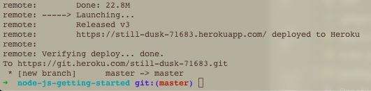

# Read:05 \| Heroku
### Website: [Heroku Setup](https://devcenter.heroku.com/articles/getting-started-with-nodejs)

## Notes from setting up Heroku
- To work with Heroku, be sure to set up a free account
- Install [node.js and npm](https://nodejs.org/en/download/) locally
- Heroku requires [Git](https://git-scm.com/book/en/v2/Getting-Started-Installing-Git)
- Install using the command line on a macOS with `$ brew install heroku/brew/heroku`
- After installation, run `heroku login`
- check your `--version` of `node`, `npm` and `git`

## Deploying a Demo App
- you can  `git clone` the link on their setup [site](https://devcenter.heroku.com/articles/getting-started-with-nodejs#prepare-the-app)
- Note: the `package.json` file is Node's dependency manager
- If you're cloning from a GitHub repo, you need to run `heroku create` to replace `origin` when pushing / fetching to your **Heroku** app since `origin` will be attached to the GitHub repo you cloned. 
- To copy the cloned GitHub repo to your **Heroku** app, run `git push heroku master`
- At the end of the push run the command line under "launching...." section whill read out your URL for the app - see image for example: 
  

> You can see logs on your Heroku account when in your app dashboard under [More > View logs](https://dashboard.heroku.com/apps/still-dusk-71683/logs) or in the terminal by running a [logging command](https://devcenter.heroku.com/articles/logging). Just press ctrl+C to get out of the logs.

[Back to Home](README.md)