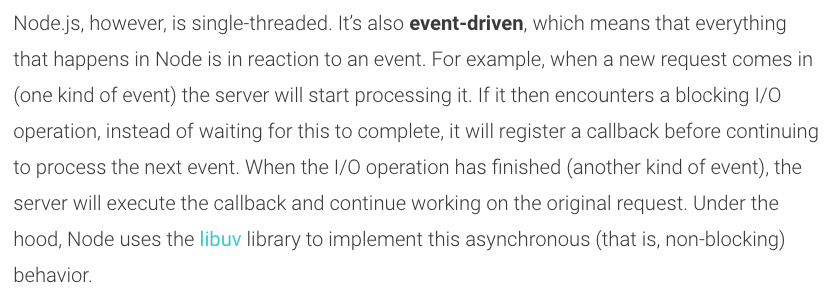
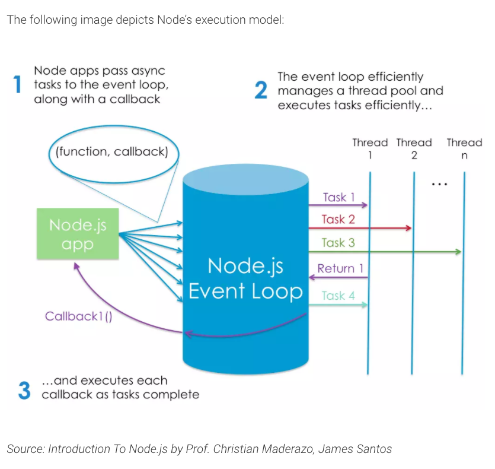
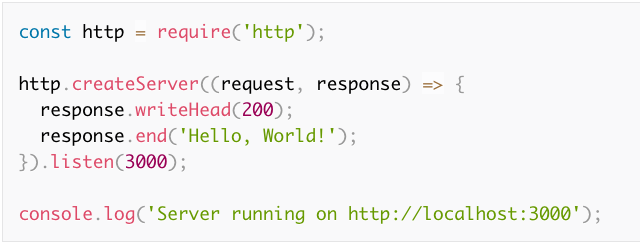

# Read:06 \| Node.js
### Website: [Intro to Node on Sitepoint](https://www.sitepoint.com/an-introduction-to-node-js/)

## Notes on Node.js

- Node.js basically translates your JS files into binary for a server to read

> By the end of this article, hopefully [StackOverflow's definition](https://stackoverflow.com/tags/node.js/info) will make sense:  
> Node.js is an event-based non-blocking asynchronous I/O runtime that uses Google's V8 JavaScript engine and libuv

- Node is built on Google Chrome's V8 open-source JS engine
- Use a version manager to grab Node binaries for your system
  - It negates potential permission issues when using Node with npm
  - Lets you set a Node version on a per-project basis
- You can check what version of Node is installed by typing `node -v`
- You can run your file with Node by typing `node hello.js`
- Node comes bundled with a package manager called `npm`. You can check which version you have installed by using `npm -v`.
- To globally install a package, you use `-g` like this: `npm install -g jshint`
- To learn about linting, see this article: [A Comparison of JavaScript Linting Tools](https://www.sitepoint.com/comparison-javascript-linting-tools/)
- `npm init` will create a `package.json` file in whatever folder you are in.
- If you run `npm install` it will create the `node_modules` folder, which contains any libraries that are referenced as dependencides in your `package.json`
- Also check out [A Beginner’s Guide to npm — the Node Package Manager](https://www.sitepoint.com/beginners-guide-node-package-manager/).
- Basically, **installing** (is the purpose of npm) and **running** (is the purpose of node) various build tools for developing a modern JS application.
- To develop with a JS framework like **React** you must know how to use Node and npm (and maybe yarn)
- The biggest use case for Node.js is for running JS on the server
- Here's an image that explains the event-driven aspect of Node.js:

  

- Node's execution model causes the server very little overhead, which makes it capable of handling a lot of simultaneous connections:

  

- The arrival of ES6's native Promises followed closely by async/await minimizes the downside of Node (excessive callbacks).
- Node has a native `http` module that uses the `createServer` method.
  - It takes an anonymous function with 2 arguments: `request` and `response`.
  - This function is invoked every time a new connection is made to the server.
  - We tell the server to listen on a particular port number and have it output a message to let us know it is running.

  

- Node is used for building applications that require real-time interaction like chat sites.
- There are various frameworks that can reduce the boilerplate, like [express](http://expressjs.com/).
  - If you want to do anything out of the ordinary you need to pull in additional modules with npm.
- Node's big plus is that is speaks JSON, which is the language used for interacting with object databases (like MongoDB).

[Back to Home](README.md)