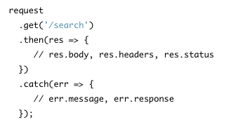
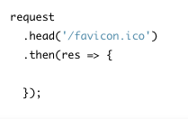
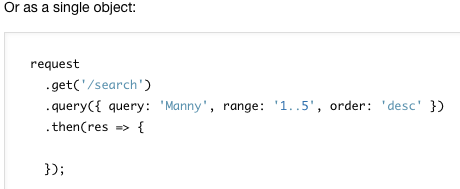
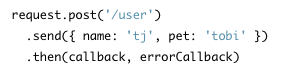
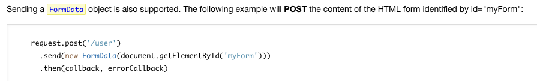
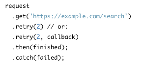
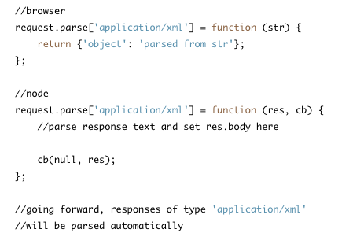
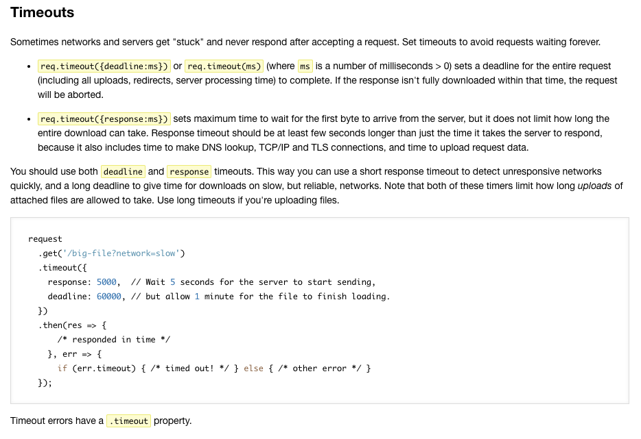
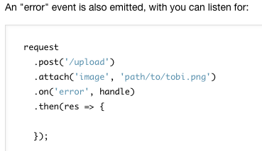
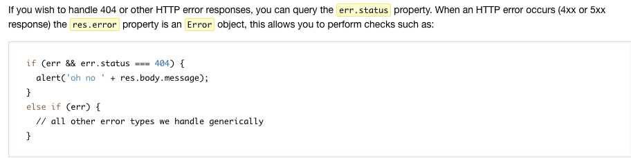

# Read:07 \| REST
Article: [How I explained REST to my brother](https://gist.github.com/brookr/5977550)  
Documention: [SuperAgent](https://visionmedia.github.io/superagent/)  
Article: [What Google Learned From Its Quest to Build the Perfect Team](https://www.nytimes.com/2016/02/28/magazine/what-google-learned-from-its-quest-to-build-the-perfect-team.html)  

## Notes from [How I explained REST to my brother](https://gist.github.com/brookr/5977550)

- HTTP is a protocol method that's like GPS coordinates for knowledge and information on the internet.
- The whole World Wide Web is built on a structure called REST, which provides a concept of the resource it is pointing to.
- A URL creates a representation of the concept that was asked for.
- `redirect` is the idea that all machines can talk about all the stuff on all other machines (ping pongs us around the internet via URLs)
- A URL is the machine's equivalent of a **noun**
- REST is the machine's equivalent of a **verb**
- A single REST verb like **GET** can be applied to many different "nouns"
- The HTTP protocol that Roy Fielding and his friends created is all about applying the verbs to nouns
- "Ideally, every URL would have a human-readable and a machine-readable representation. When a machine GETs the resource, it will ask for the machine-readable one. When a browser GETs the resource for a human, it will ask for the human-readable one."
- HTTP GET retrieves information, HTTP POST if I want to add something to another system, or HTTP PUT/PATCH if I want to replace something in another system.
- Basically, developers today are just trying to decide how to best model data using RESTful web frameworks.

## Notes from [SuperAgent](https://visionmedia.github.io/superagent/)

- Superagent is a lightweight progressive AJAX API
- Here is an example of the basic `request` object with a simple GET request:

  
- DELETE, HEAD, PATCH, POST, and PUT are the same, just change the method name as in the example below:

  

- Set header fields simply with `.set()`. Like this: `.set('Accept', 'application/json')`
- The `.query()` method accepts objects (also single strings or joined strings) and when used with `get()` will form a query string. You can also use `.query()` for HEAD requests. Below is an example of a single object:

  

- The default content-type for superagent is JSON. The `send()` method is used for POST and PUT requests:

  

- Here is another example for POST request sending `FormData`:

  

- Superagent automatically serializes JSON and forms.
- When you want your request retried when it fails, use the `.retry()` method. It takes two optional arguments, the number of times you want it to retry and a generic callback which will return true or false to control whether the request should be retried.

  

- The superagent will parse known response-body data and you can set up automatic parsing for other response-body data like this:

  

- The property `res.body` is the parsed object. For example, if a request responded with the JSON string `{"user":{"name":"tobi"}}`, then `res.body.user.name` would be `"tobi"`.
  - For multi-part form data, there's a `Formidable` module, and you would use the object `res.files`.
- The `response` object has many useful flags and properties: 
  - `res.text` contains unparsed response body string
  - `res.body` contains the parsed response body object
  - `res.header` contains an object of parsed header fields: `res.header['content-length']`
  - `res.type` is the content-type from the header
  - `res.charset` would contain `"utf8"`
- Handling timeouts when a server isn't responding is explained the below screenshot:

  

- To attach files, use `.attach(name, [file], [options])` (can be used multiple times).
- Like form fields in HTML, you can set field values with `.field(name, value)` and `.field({name: value})`.

> Note to self: I haven't had time to read up on CORS, here is a link to do that: [Read more about CORS](https://developer.mozilla.org/en-US/docs/Web/HTTP/Access_control_CORS)

- You can make an error event that takes two arguments, error and response: 

  

- Superagent considers 4xx and 5xx responses errors by default, but if you wish to handle 404 or other HTTP errors, you can use the `error.status` property like below:

  

- Here are other things to know about that we won't go into detail here: progress tracking, testing on localhost, ignoring broken insecure HTTPS on localhost, promise and generator support

> Note about browser and Node versions (directly quoted from article):  
SuperAgent has two implementations: one for web browsers (using XHR) and one for Node.JS (using core http module). By default Browserify and WebPack will pick the browser version.  
If want to use WebPack to compile code for Node.JS, you must specify node target in its configuration.

## Notes from [What Google Learned From Its Quest to Build the Perfect Team](https://www.nytimes.com/2016/02/28/magazine/what-google-learned-from-its-quest-to-build-the-perfect-team.html)

- Studies have shown companies are more profitable and work is done faster and more correctly when a group of employees work together vs work as individuals
- In 2011 Google became focused on finding the solution to build the perfect team but Google struggled to find patterns during **Project Aristotle** for quite some time when comparing member qualities so they swapped to researching *group norms*
- Group Norms was the pattern, but now they needed to identify which *shared* norms were among the successful teams
- **One norm of success:** each person got to speak the same amount during group discussion
- **Second norm of success:** members were good at intuiting other members feelings based on tone, expressions or other cues

>Basically, a group is more likely successful when members feel **psychological safety** via communication turn-taking and empathy

[Back to Home](README.md)