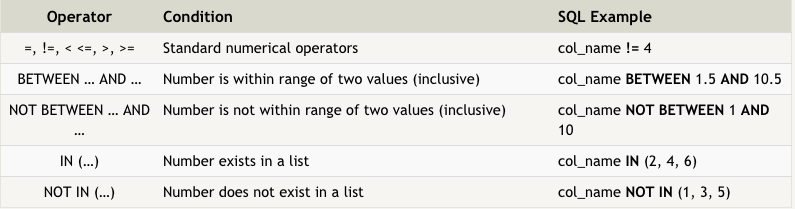
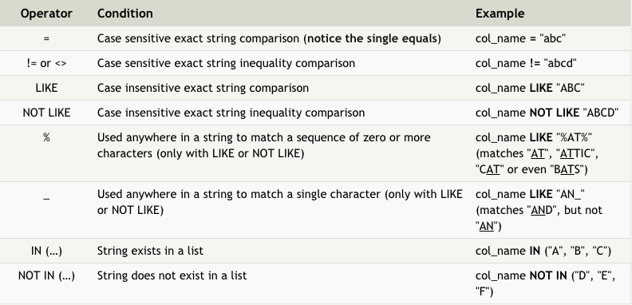
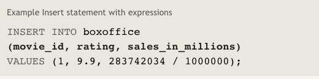
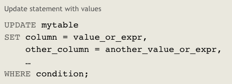
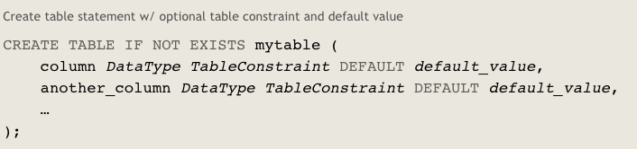
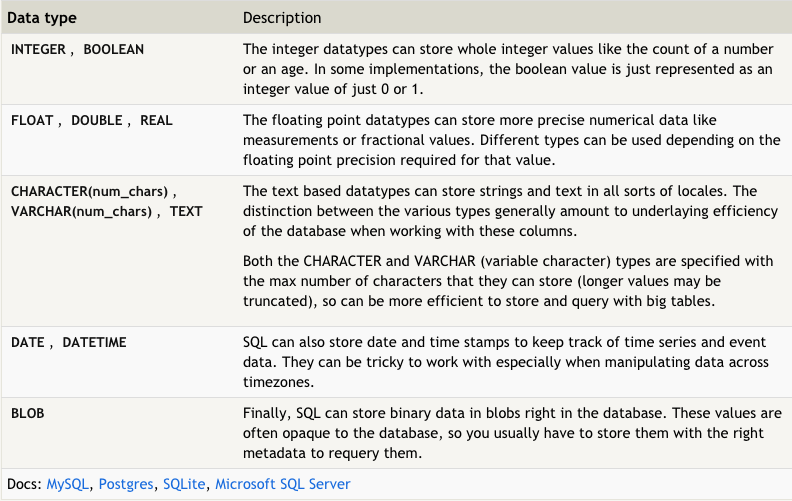
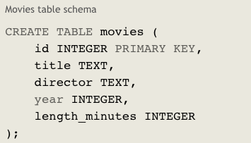
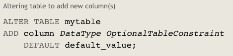
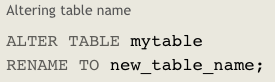

# Read:08 \| SQL (Structured Query Language)
Lessons: [SQL Bolt Lessons](http://sqlbolt.com/)  
Additional Resources to skim: [A Primer on SQL (downloadable PDF Book)](https://openlibra.com/en/book/a-primer-on-sql-3rd-edition)  | [SQL Cheat Sheet](http://www.cheat-sheets.org/sites/sql.su/)  


## Notes from [SQL Bolt Lessons](http://sqlbolt.com/)

#### Retrieving data

- To retrieve data form a SQL database, use `SELECT` statements
- A "table" in SQL is a type of entity, while each row is an instance of that type
- Columns are properties shared by all instances (rows) of the entity (table)
- A simple select statement:

  ```sql
  SELECT column, another_column
  FROM mytable;
  ```

- The `*` shorthand means "all columns" and can be used in SELECT: `SELECT * FROM mytable`
- A`WHERE` clause takes a condition to find a specific set of rows
- Here are some operators that can be used with `WHERE`:

  

- All strings in queries must be quoted so the parser knows they are not SQL keywords
- Here are some operators that can be used for text columns:

  

- Duplicate rows can be removed with `DISTINCT` keyword
- `ORDER BY` helps sort data. For example: `ORDER BY column ASC`
- `LIMIT` reduces the number of rows returned, and `OFFSET` says where to start counting rows from.

#### Modifying data

- A "schema" describes the structure of the table and data types of each column. For example, the year column should be an integer and the title should be a string.
- `INSERT` query puts rows into the table into the specified columns. Here is an example:

  

- `VALUES` for the INSERT are listed in parentheses.
- `UPDATE` queries update rows in the database.

  > Note: Always use a `SELECT` query to make sure you are updating the right rows before updating.

  

- `DELETE` queries delete rows from the database.
- Use a `WHERE` condition with `DELETE` or ALL rows will be deleted. You can also test this with `SELECT` first.

#### Modifying the schema

- You can create new tables with `CREATE TABLE`
- `IF NOT EXISTS` can be added to avoid an error in case the table already exists.
- Here is an example:

  

- Below are some of the common data types available for columns:

  

- Here is an example schema for the table used in this exercise:

  

- `ALTER TABLE` can add, remove, or modify columns in a table that already exists. Here is an example:

  

- Here is an example of renaming a table:

  

- Within an `ALTER TABLE` query, you can delete a column with the `DROP` keyword.
- You can remove an existing table entirely using `DROP TABLE IF EXISTS movies`.


  


[Back to Home](README.md)