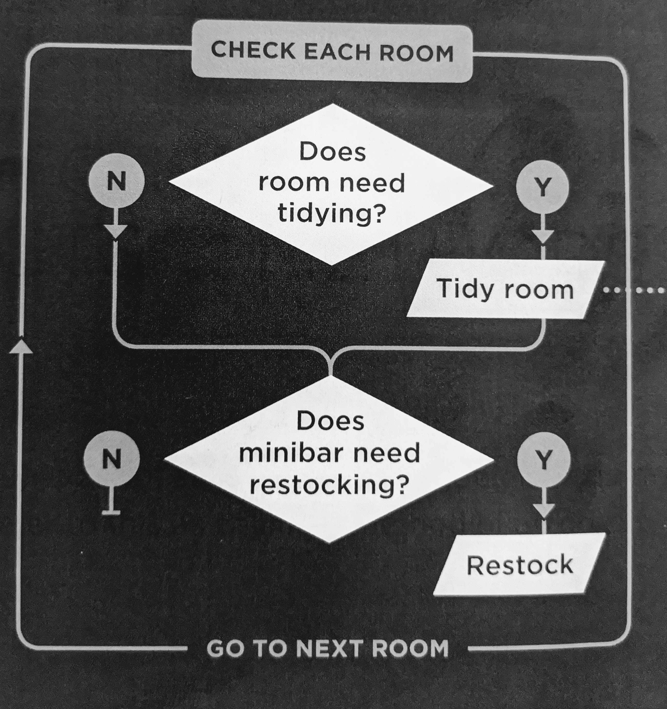
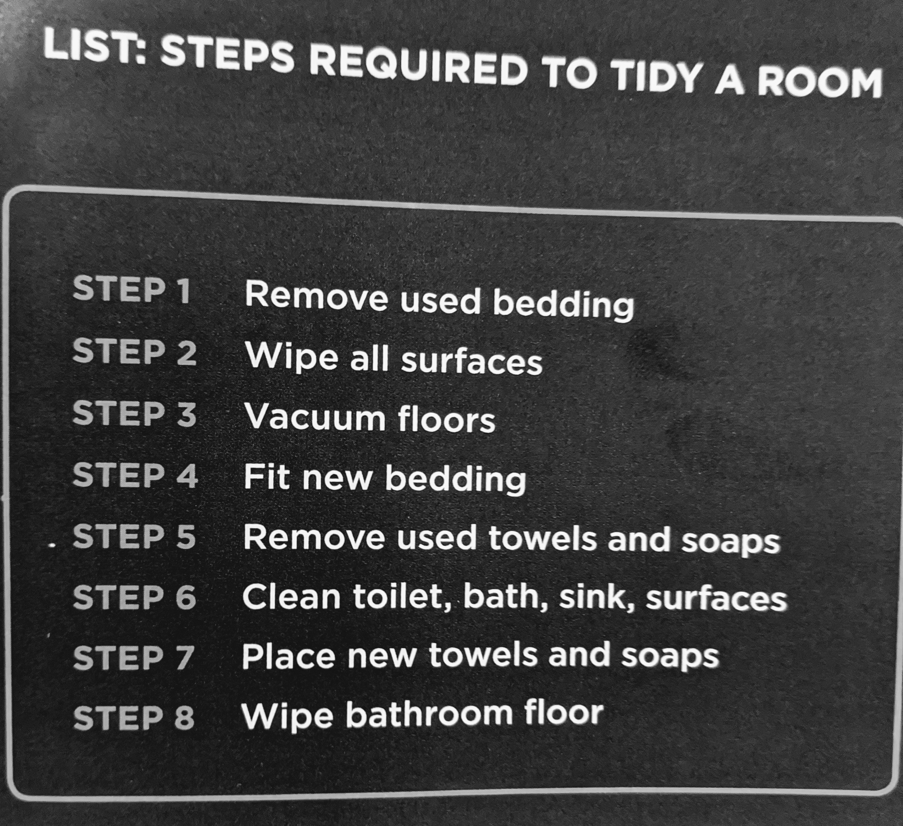

# Read:01 \| Intro HTML & JavaScript
[Textbook](https://www.amazon.com/dp/1118907442/ref=cm_sw_em_r_mt_dp_U_X77.EbAN2ACE2): _Jon Duckett: HTML & CSS_ + JavaScript & jQuery  
*(HTML book: Introduction, Chapters 1, 8, 17, 18 \| JS book: Introduction, Chapter 1)*  

---
## Intro to HTML
---

### Process & Design
- Understand **_who_** your website is for (individuals vs. companies)
- Understand **_why_** you want people on your website
- Understand **_what_** the visitors need to acheive the goal of the website
- Understand **_how_** often your content needs to be updated and how often people will visit the site
- Create a **_site map_** to understand the overall structure of your various pages/content
- Design a **_wireframe_** showing how each page layout will look (logo, buttons, text box, etc)
- Get your message across by thinking about these categories: 
   - Content
   - Priortizing (disction on the page)
   - Organizing (content chunks)
   - Visual Heirarchy (size, color, style)
   - Grouping (use of borders, white space, etc)
   - Similarity (like all clickable links are same color)

### Structure
- This refers to your overall flow/structure of your page using elements made up of tags
- Similiar to how you'd structure a classic document in MS Word
- The main required elements for every page are: ```<html>```, ```<head>```, ```<body>```
- The ```body``` is where the content goes that the user will see, and metadata is typed in the ```head```
- Most elements will have opening ```<p>``` and closing ```</p>``` tags *(though some will be standalone)*
- Tags ```<p>``` can have Attribute names & values in the opening tag

### HTML5 Layout
- New elements added for use such as: ```<nav>```, ```<header>```, ```<footer>```, ```<aside>```, etc.
- You can now place an anchor tag around a block level element to make the entire block clickable

### Extra Markup
- Comment in your code to help others understand the purpose of a section using ```<!-- -->```
- Use Global Attributes like ```class``` and ```id``` to be able to refer to specific elements in other code files (like css and javascript)
- Use the ```<meta>``` tag in your **_head_** like a description, key words, robots, author, etc. 
- If you want to use an html character like ‘<’ you can use escape characters associated with it (google it for the character you’re trying to escape out into your presentation)

---

## Intro to JavaScript
---

### Design the Script
It's ideal to *design* the **tasks** and **steps** of your script to fully understand how you'll be writing the code. Below are examples of what this looks like from *Duckett's* book referenced at the top of the page:   



### Objects, Events, and Methods, Oh My!
##### Objects (Things)
- Objects can have one or more **instances**
- Each object can have its own: Property / Event / Method -- which together is the **working model** of that **object**
- **Properties** are charactistics in an object and have a *name* & *value* which can tell you info about each **instance** of the object
##### Events 
- Something that happens when the user performs a specific interaction with the program (Ex: clicking on something)
- You can trigger different types of events in specific places of the code for catered functionality
##### Methods
- A method is code that containts instructions to represent a specific task to be applied
- The method basically represents how something interacts with the object
- They can tell you things about the object or change the value of one or more properites of the object

### DOM | The **D**ocument **O**bject **M**odel
- When you open a browser (like Chrome) the Object you first see is the *window* (the browser tab) and inside that object, the *document* object is rendered
- The Document Object Model represents the **HTML** page and contains properties, methods, and events
- The DOM receives initial HTML code and stores a model of it in memory (often referred to as the DOM tree), which is where JavaScript will interact with the HTML


### JS Lingo
- *Statements*: are instructions and each one starts a new line; can be organized in code blocks and usually end with `;`
- *Comments*: Single line comments explaining the code is written with `//` before the text (multi-line uses `/* */`)
- *Variables*: declare them like this `var thing;`, assign them using = Ex: `thing = 3;`
- Names can’t start with a number, cannot use - or . and use camelCase
- *Data Types*: Numeric data (0.75), String data (“Hello”), Boolean Data (true/false)  

### JavaScript Tidbits
- HTML = content, CSS = presentation, JavaScript = behavior
- JS is plain text like HTML and CSS so no special tools needed to write the script
- Connect the JS script via a `<script>` tag in the HTML body / it matters where you place this
- _Calling a method_ is using an object, a dot and the method() / Ex: `document.write(‘hello’);`
- Methods often have parameters (the values written in the parenthesis(‘hello’))
- To use a quote in a string you can use the escape key `/`

[Back to Home](README.md)