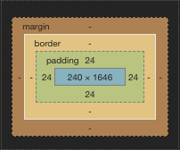

# Read:03 \| HTML Lists, CSS Boxes, Control Flow w/JS
Textbook: _Jon Duckett: HTML & CSS_ + JavaScript & jQuery  
*(HTML book: Chapters 3 + 13 \| JS book: Chapters 4*

---
## HTML
---
### Lists
- There are 3 list types in HTML: **Ordered** (item indicated by a number), **Unordered**
(indicated as bullet point dots), **Definition** (term followed by indented definition)
- For ordered and unordered lists you use the `<li>` element for each list item. And you can nest another ordered or unordered list inside of an existing list for further indentation and sub bullets.

Example of an Unordered List in HTML syntax: 
```
<!-- in the body of the document -- >
<body>
	<h1>My List</h1>
	<ul>
		<li>Bananas</li>
		<li>Apples</li>
	</ul>
</body>
```

---
## CSS | Boxy Stuff
---
### Boxes \| Width & Height 
- Boxes are the basic design of HTML elements, with CSS we can control the **dimensions**, **borders**, **margins**, **padding**, etc of these boxes. Outside of this manipulation is also how and where to position the boxes on the page using the **Box Model**
- Manipulating the boxes can be done with numbers assigned as pixels, percentages, ems or rems. 
	-Ex: width: 400px \| or width: 75% 
- `width` & `height` can also be dictated with min and max features tagged on like this: `max-width` or `min-height` to maintain specific ratio control as the window size changes

### Borders, Margins & Padding
- Every element/box has **3 main properties** surrounding it to adjust its appearance: **Border**, **Margin**, **Padding**  
Example of the 3 properties surrounding an element:


- **Border** is the area between the margin and padding and usually refers to the visible or invisible container line separating the padding and margin 
- Borders can be thin, medium, thick or specified by pixel amount and have a *top*, *left*, *right*, and *bottom*. You can set all these as the same number or specify which part of the border you want adjusted, such as: `border-top-width: 2px;` to only change the thickness of the top line of the border.
- Default language built into CSS can also identify a `border-style` like *solid*, *dotted*, or *groove*, etc. Also, the `border-color` property to make the border line be black or green, etc.
- Borders can utilize other properties such as `border-radius` to round the corners by a certain amount; `box-shadow` to control if you want it to look 3-D with a shadow from an edge of the box
- You can also use shorthand for border to set it’s width, style and color respectively all in one line
	- Ex: `border: 3px dotted #0088dd;`
- **Margins & Padding** can also be controlled by specifying their top, bottom, right or left value. 
- **Margin** refers to the outer most box of the diagram below and adds space on the outside of the element box
- **Padding** refers to the space between the border line and the edge of the element. In other words, adding 10 pixels of padding to all sides would make the text be 10 pixels of space away from the border line (as opposed to right next to the border line immediately)

---
## JavaScript | Control Flow
---
### Switch Statements
- These are different versions of `if/else` logic
- The statement starts with **switch** variable followed by multiple **case** to indicate a possible value of this variable and the code that should run if the values match
- End each `case` with `break;` to tell the code to stop here  in the statement and move on to other code in the script if this case renders true
- Using a **switch** statement means the code won’t run through all options if one is found, whereas in **if** statements, it will run through all options no matter what before continuing

Example of a Switch Statement: 
```
var msg;
var level = 2;

Switch (level) {
case 1:
  msg = ‘You’re on level 1’;
  break;
case 2: 
  msg = ‘You’re on level 2’;
  break;
case 3:
  msg = ‘You’re on level 3’;
  break;
default:
  msg = ‘I don’t know where you are’;
  break;
}

var answer = document.getElementById(‘answer’);
answer.textContent = msg; // should print “You’re on level 2” to the user
```

### Data Type coercion \| truth**y** or fals**y**
- JS tries to be efficient and smart by converting data types behind the scenes to ensure it can try its best to execute an operation. This is referred to as **type coercion**. 
  - Note: This can be dangerous, so it’s ideal to always manually convert your data between strings or numbers and using strict (compares same data type only) comparison operators (like `===` instead of `==`) to avoid errors and mistakes by the code or user
- Because of the fancy type coercion, everything in JS has an inherent **truthy** or **falsy** value (not to be confused with the strict boolean confirmed version of **true** vs. **false**

Image from textbook referenced above of the Falsy / Truthy Table: 


### Loop d’Loops
- Loops check a condition x number of times until a specified condition is met; once met, it will run the code written inside it's `{}`
  > **while** loops until it's true, whereas **for** loops runs the number of times you’ve set in the condition)
- In **for loops** you must *initialize* (`var i = 0;`), set the *condition* (`i < 10;`) and *update the iteration* (`i++`)
  - Ex: `for (var i = 0; i < myArray.length; i++) {};`
- Special case loop: **do...while** loop will run at least once even if false becuase you place the statements *before* the condition
  - Ex: `do { msg += i + " x 5" + (i*5); i++;} while (i < 1);` // result: 1 x 5 = 5

[Back to Home](README.md)