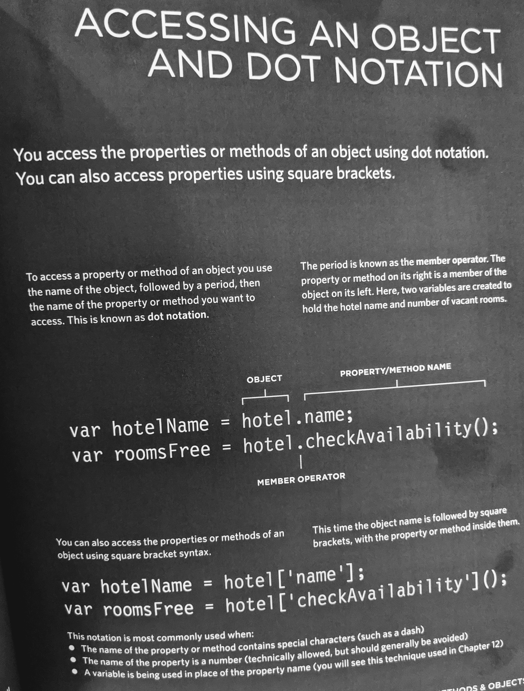
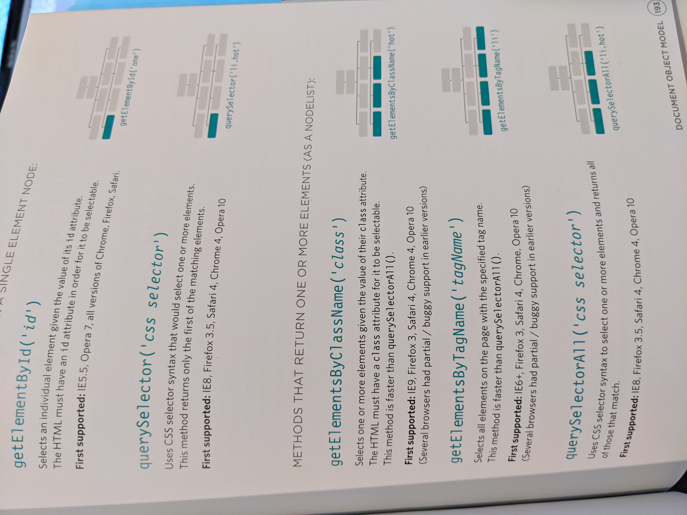

# Read:06 \| JS Object Literals & The DOM
[Textbook](https://www.amazon.com/dp/1118907442/ref=cm_sw_em_r_mt_dp_U_X77.EbAN2ACE2): _Jon Duckett: JavaScript & jQuery  
*(JS book: Chapters 3 + 5)*  
Article: [Understanding the problem domain is the hardest part of programming](https://simpleprogrammer.com/understanding-the-problem-domain-is-the-hardest-part-of-programming)

---
## JS | Object Literals
---
> Objects contain a set of **variables** and **functions** that create a **model** of something    
- **variables** become known as a **property** inside an Object, like the *name* of something
- **functions** become known as a **method** that performs a task like check how many rooms in the hotel object are booked
- The **property** names are called the **key**, each Object has **key** / **value** pairs in their list of **properities**
	- Ex: `name: ‘Jack’,` *name*  is the **key** and *Jack* is the **value** of the **key** and the **key** is the *name* **property** in the **object**
- The textbook referenced above does a great job with visuals for **Creating an Object Literal** and **Accessing an Object Literal w/Dot Notation**, so I’ve added the images below: 

  **Creating an Object Literal**  
  

  **Accessing an Object**  
  

---
## HTML + JS | Document Object Model (DOM)
---
- When you open a browser (like Chrome) the Object you first see is the window (the browser tab) and inside that object, the document object is rendered
- The Document Object Model represents the HTML page and contains properties, methods, and events
- The DOM receives initial HTML code and stores a model of it in memory (often referred to as the DOM tree), which is where JavaScript will interact with the HTML

#### Nodes
> DOM trees have 4 types of Nodes that are used as reference for navigating, accessing and updating various aspects of the website. If a query has more than one node, it will return a NodeList  
- **Document Nodes**: `document` node which encompasses ALL nodes on the page
- **Element Nodes**: These are the element tags like `<h1>` or `
` etc.
- Can select them by `id` or `class`, tag name or CSS selector syntax
- Access and Update content using properties like `textContent` and `innerHTML`
- Can contain multiple **text** nodes, child elements that are siblings of each other
- **Attribute Nodes**: The attr’s in the opening tag, like `src=` or `alt=` etc.
- **Text Nodes**: The text between tags

- You access the DOM in various ways referencing Element or Attribute nodes, below is an image of methods that access the DOM: 

  

---
## Article | [Understanding the problem domain is the hardest part of programming](https://simpleprogrammer.com/understanding-the-problem-domain-is-the-hardest-part-of-programming)
---
- Often times the Problem Domain isn't clear which will lead to bad code
- Be sure to have a clear understanding of the Problem Domain before starting the code
- You can simply the Problem Domain but cutting it into smaller chunks

[Back to Home](README.md)