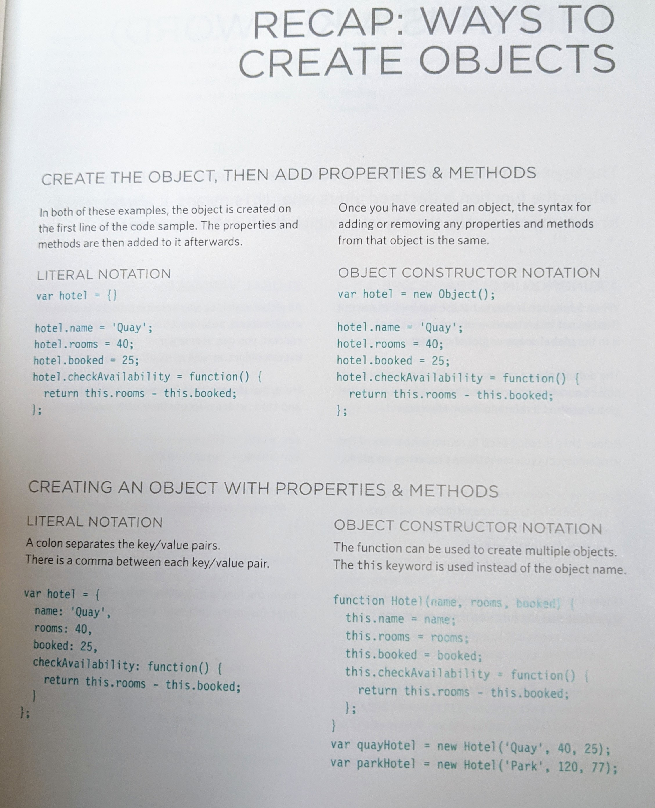

# Read:07 \| HTML Tables & JS Constructor Functions
[Textbook](https://www.amazon.com/dp/1118907442/ref=cm_sw_em_r_mt_dp_U_X77.EbAN2ACE2): _Jon Duckett: HTML & CSS_ + JavaScript & jQuery  
*(HTML book: Chapters 6 \| JS book: Chapters 3)*  
Article: [Domain Modeling](https://github.com/codefellows/domain_modeling#domain-modeling)

---
## HTML | Tables
---
- You can add tables to your webpage via HTML element tags, here is the list below:   
`<table>` is the main tag you’ll nest the below tags in  
`<tr>` sets up each row of data in the table  
`<th>` will dictate a header default style if you want a header row at the top of the table  
`<td>` is the place you’ll write the table data / value / string  
- There are optional tags you can utilize such as `<thead>, <tbody>, <tfoot>` 

---
## JS | Functions, Methods & Objects
---
- **Constructor Notation**: To create an empty object to add key/value pairs to later just type: `var hotel = {};`
- To update the object use **dot notation**
	-Ex: `hotel.name = ‘Park’;` Hotel is the **object**, name is the **property** and ‘park’ is the **property Value**
- For **many** objects for a Constructor Notation you’ll use a **function** as a template to create new **instances** of the **object**. 
- You can use true and false to add or remove **properties** (`hotel.gym = true;`)  

This is best represented by the images from the book referenced above: 

> **this** is an awesome keyword that can be used in scope of functions to reference the variable or object the function operates

- **Array** is an object with key/value pairs. 
- As a regular **array** `costs = [100, 200, 300];` the key is the **index** (the place where the value is in the list), and the **value** is the actual thing like `100` or `200`. 
- As an object **array** the index key is replaced with a property name `costs = { room1: 100, room2: 200};`
- You might recall DOM (Document Object Model); object is in the name! You can reference properties in the document object like this: `document.title` just like we saw in the images of dot notation
- JS has built-in objects such as *string*, *number*, *Math*, *Date*, etc. 

---
## Article | [Domain Modeling](https://github.com/codefellows/domain_modeling#domain-modeling)  
---
- This is the idea of creating a model of code that will solve a specific problem
- To create a new **instance** of an object, use the keyword `new` and then call the constructor function
- From this article they say, “An entity that stores data in properties and encapsulates behaviors in methods is commonly referred to as an **object-orientated** model.”
- Self-contained objects will have the same **attributes** and **behaviors** so future changes are small
- This article does a REALLY good job at summing up Object-orientated Programming with this section in their document: 

> #### This is object-oriented programming in JavaScript at its most fundamental level.
> - The new keyword instantiates (i.e. creates) an object.
> - The constructor function initializes properties inside that object using the `this` variable.
> - The object is stored in a variable for later use.

A great **example** from this document to look closely at code for **Calculating Daily Likes** on something like a video (or comment, etc), [visit this link](https://github.com/codefellows/domain_modeling#calculate-daily-likes)

[Back to Home](README.md)