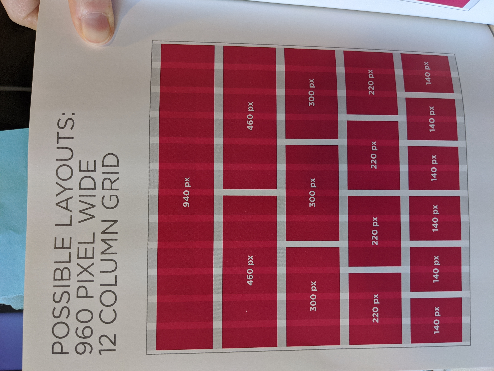
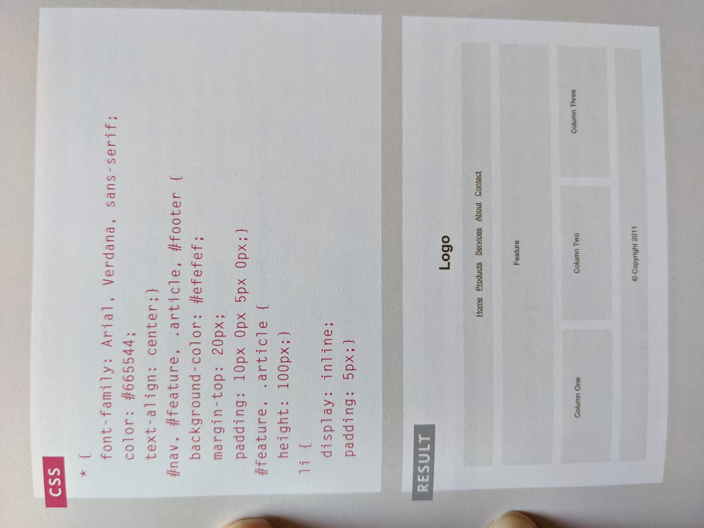

# Read:08 \| More CSS Layout
[Textbook](https://www.amazon.com/dp/1118907442/ref=cm_sw_em_r_mt_dp_U_X77.EbAN2ACE2): _Jon Duckett: HTML & CSS_ 
*(HTML book: Chapters 15)*  

---
## CSS | Layout
---

- It's best to use an HTML tag like `
` that allow you to lump other tages inside of it to work as a container that you can assign an **id** to and use in your CSS file to move around the page
- HTML pages in browsers have a standard flow until you specify in a CSS file if you want **relative**, **absolute** or **fixed** positioning for your various elements
- The `float: ` property is great for putting things to the left or the right of other elements on the page (Note: these require a defined width)
- Your website can have a **fixed** or a **liquid** (today we call this **responsive**) layout (meaning things on the page might change depending on the size of your browser window)
- **Grids** are an ideal way to think about page design, specifically the 12 column model (Things like *[Bootstrap](https://getbootstrap.com/)* are built off of this.)
- You can connect multiple CSS files to your HTML document, but be mindful of the order the links are listed in for rendering purposes

Great image reference to the Visual & Code/Result of utilizing the **Grid Layout**

  

[Back to Home](README.md)