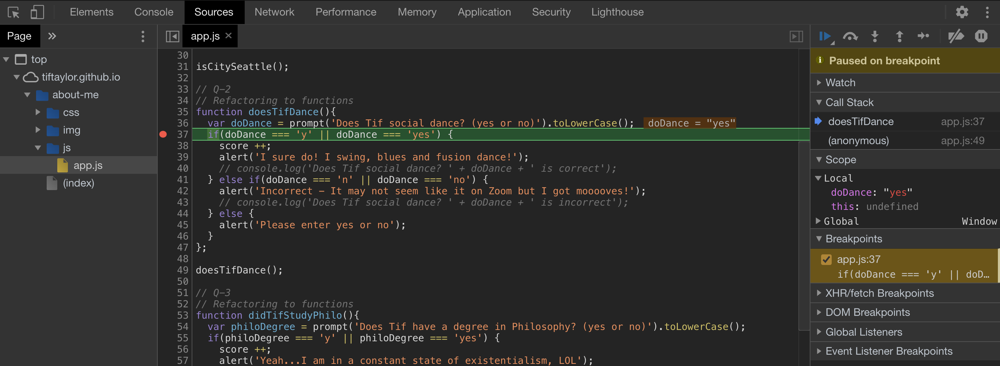
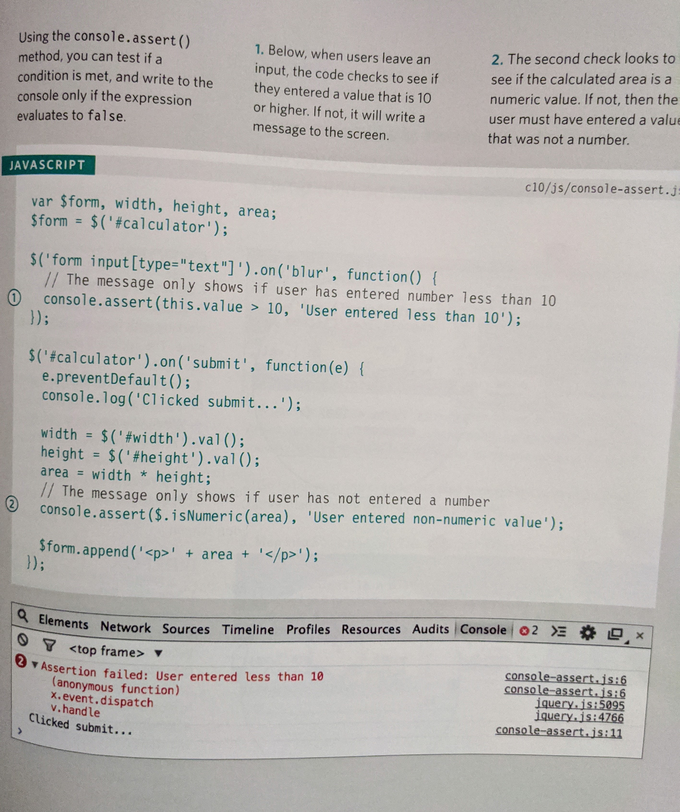
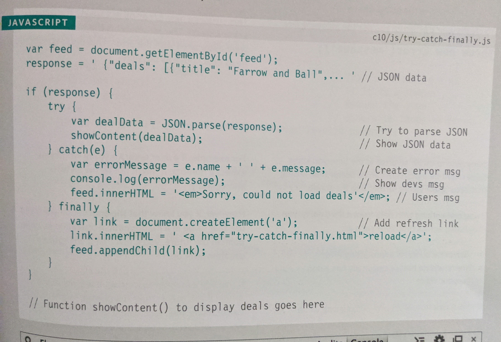

# Read:10 \| JS Debugging
[Textbook](https://www.amazon.com/dp/1118907442/ref=cm_sw_em_r_mt_dp_U_X77.EbAN2ACE2): _Jon Duckett: JavaScript & jQuery  
*(JS book: Chapter 10)*  

---
## JS | Error Handling & Debugging
---

- Always remember to think about the **order of execution**
  - Variable declarations are read first even if they are not at the top of the page
  - Function definitions are read second
  - Expressions are read last (i.e. when you call a function)
- Pay attention to the **execution context** and **variable scope**
- Hoisting is not ideal (don't call a function before it is written), but using it in a callback function before it is declared is fine
- Error objects: Error, SyntaxError, ReferenceError, TypeError, RangeError, URIError, EvalError

#### Debugging Workflow

- Where is the problem? 
  - Look at the error message in the console
  - Write to the console how far your script has executed
  - Type `debugger;` to control where your script ends when testing sections to look for the problem
- What is the problem?
  - Check the number of parameters for functions
  - Check the number of items in arrays
  - Isolate and run small chunks of code
  - Again, utilize **breakpoints** from Inspect/DevTools and use the Source tab to set breakpoints and check the value of variables. See screenshot:  
  

#### Browser DevTools and JS Console

- As seen in the image above, use the Chrome DevTools tabs Console and Sources to look for errors
- You can test expressions directly in the Console
- Use `console.log()` in your code when you want to display the value of something in the Chrome Console
- Use `console.table()` to show a table about objects or arrays, e.g. `console.table(contacts)`

`console.assert()` is useful to check if some data is what you expect:  

#### Handling Exceptions

- `try`: put code in here you want it to try to execute
- `catch (exception)`: if there's an exception, run this code
- `finally`: code that will *always* get executed  
  

> To create your own error, use the following line: `throw new Error('message');`. You might use this after an `else` statement.

#### Common Errors

- Check single/double quotes
- Checked that you've escaped quotes in strings
- Make sure your `id` attributes are unique
- Make sure statements end with a semi-colon
- Check your `{}` and `()` matching
- Check your function parameters
- Make sure your script is loaded
- Look for conflicts between multiple script files
- Check for data type issues like using `=` or `==` instead of `===`
- Check variable scopes

[Back to Home](README.md)