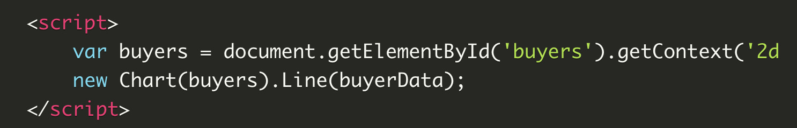

# Read:12 \| API Chart.js + Canvas Element
[Chart.js Article](https://www.webdesignerdepot.com/2013/11/easily-create-stunning-animated-charts-with-chart-js/)

---
## API | Chart.js
---
[Chart.js Article](https://www.webdesignerdepot.com/2013/11/easily-create-stunning-animated-charts-with-chart-js/)  
[Chart.js Documentation](https://www.chartjs.org/docs/latest/)

- Chart.js is a JS **plugin** || **API** || **Library** that uses HTML5's Canvas element to draw charts
- Download (or grab a CDN link) Chart.js | copy `Chart.min.js` out of the unzipped folder and into the directory you're working in
- Connect the `Chart.min.js` file in the HTMl `<head>` in a `<script>` tag
- Utilize a `<canvas>` element
- For example, to draw a **line chart** you would use a mix of vanilla JS and special methods built in to the `<canvas>` element
- Here's an example from the referenced article:  


- You'll also write a JS object literal that will have key-value pairs for the chart labels and datasets (design and data)
- Here is a link to a Chart.js demo


---
## API | Canvas
---
MDN doc links relating to the use of the `<canvas>` element
- [Basic Use of Canvas](https://developer.mozilla.org/en-US/docs/Web/API/Canvas_API/Tutorial/Basic_usage)
- [Drawing Shapes with Canvas](https://developer.mozilla.org/en-US/docs/Web/API/Canvas_API/Tutorial/Drawing_shapes)
- [Applying Styles and Colors](https://developer.mozilla.org/en-US/docs/Web/API/Canvas_API/Tutorial/Applying_styles_and_colors)
- [Drawing Text](https://developer.mozilla.org/en-US/docs/Web/API/Canvas_API/Tutorial/Drawing_text)

Key Takeaways: 
- If `width` and `height` aren't set the default is 300x150 pixels
- The script uses `getContext()` to get the rendering context of the canvas to draw
  ```js
  var canvas = document.getElementById('tutorial');
  var ctx = canvas.getContext('2d');
  ```
- The canvas grid uses x-y coordinates
- The two main kinds of methods that dictate any shape drawing will be **rectangle** or **path** methods
- The two most important properties for controlling color are `fillStyle` and `strokeStyle`
- There are properties for styling lines and gradients and transparency etc.
- The two methods for rendering text are `fillText` and `strokeText`
- There are various other methods for styling text (e.g. font)

[Back to Home](README.md)