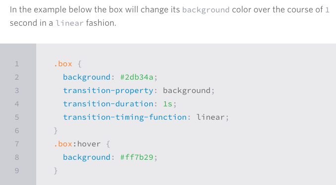

# Read:14a \| CSS Transforms, Transitions, and Animations
*(several articles are linked and referenced below)*

## Article: [What Google Learned From Its Quest to Build the Perfect Team](https://www.nytimes.com/2016/02/28/magazine/what-google-learned-from-its-quest-to-build-the-perfect-team.html)

- Studies have shown companies are more profitable and work is done faster and more correctly when a group of employees work together vs work as individuals
- In 2011 Google became focused on finding the solution to build the perfect team but Google struggled to find patterns during **Project Aristotle** for quite some time when comparing member qualities so they swapped to researching *group norms*
- Group Norms was the pattern, but now they needed to identify which *shared* norms were among the successful teams
- **One norm of success:** each person got to speak the same amount during group discussion
- **Second norm of success:** members were good at intuiting other members feelings based on tone, expressions or other cues

>Basically, a group is more likely successful when members feel **psychological safety** via communication turn-taking and empathy


## Article | CSS | [Transforms](https://learn.shayhowe.com/advanced-html-css/css-transforms/)
- `transform` allows you to manipulate an HTML element in a 2-D or 3-D perspective
- It’s as simple as adding the **property** and the **value** in `()` For example: 
```
.thisClass {
  transform: rotate(20deg);
}
```
- `scale()` will affect the 2-D size of the element
- `translate(Xpx, 7%)`  works kind of like relative positioning
- For the 90’s vibe you can use `skew(xdeg, ydeg)`

>For a SUPER AWESOME 2-D Box, here is an example this article has on [their CodePen](https://codepen.io/shayhowe/embed/AklBJ?default-tab=result&height=288&slug-hash=AklBJ&theme-id=5990&user=shayhowe&name=cp_embed_7#result-box)

- 3-D elements will start utilizing the z-axis values with perspective (same properties can be used as 2-D but thinking about the z axis. See the article for example code


## Article | CSS | [Transition & Animations](https://learn.shayhowe.com/advanced-html-css/transitions-animations/)

#### Transitions
- For a **transition** to take place, an element MUST have a CHANGE in state and a different style identified for EACH state. This screenshot from the article sums it up the necessary attributes best: (see the article link for fixing browser prefix issues)

  

- You can target multiple `transition-property` by using a `,` comma between them, like `background, border-radius` as the value of that property
- You can also transition **duration**, **timing**, **delay**. And apply to thinks like buttons for a [transitional button](https://codepen.io/shayhowe/embed/Bocnt?default-tab=result&height=138&slug-hash=Bocnt&theme-id=5990&user=shayhowe&name=cp_embed_7#html-box).

>Great Resource Website for 8 great **Transitions**: [Simple Transition Examples for WoW](http://www.webdesignerdepot.com/2014/05/8-simple-css3-transitions-that-will-wow-your-users/)

#### Animations
- A beefed up version of transitions, when even more states are required
>From the article: “The @keyframes rule includes the animation name, any animation breakpoints, and the properties intended to be animated.”
- After declaring `keyframes` you use the `animation-name:` property. 
- You can also affect an animations **duration, timing function, delay, direction, play-state, fill-mode and iteration-count**
[Here is an example](https://codepen.io/shayhowe/embed/ogJjm?default-tab=result&height=234&slug-hash=ogJjm&theme-id=5990&user=shayhowe&name=cp_embed_13#html-box) that utilizes a lot of the these

>Resource CodePen for **Keyframe Animation**: [CSS3 Keyframes Animations](https://codepen.io/akshaychauhan/pen/oAfae)

>Resource CodePen for **Animated Buttons**: [6 buttons animated](https://codepen.io/retyui/pen/ByoaXV)

>Resource CodePen for: [Pure CSS Bounce Animation](https://codepen.io/dp_lewis/pen/gCfBv)

[Back to Home](README.md)